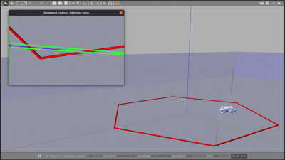

# Digital Twin of CavePI AUV

## Compatible Platform

The packages are tested on ROS Noetic with Gazebo Classic.

## Usage

1. Clone the repo and place the four packages inside `~/catkin_ws/src/` directory in your local computer.
2. Download the 3D models of the CavePI links from here: [Dropbox link](https://www.dropbox.com/scl/fo/h16z4oh9wp337o5n7fm5i/AFeJVwF5MsPjYP4ErddTO0g?rlkey=9oo4m484tb7dqusxe6gjbov9v&st=hvr9hmgv&dl=0)
3. You will find a folder named `meshes` in the link. Download the folder and place it inside `~/catkin_ws/src/cavepi_description/`.
4. Build and source the ROS workspace.
   ```sh
   cd ~/catkin_ws/
   catkin_make
   source devel/setup.bash
   ```
6. For visualizing the digital twin model in RViz, run a ROS launch file:
   ```sh
   roslaunch cavepi_bringup display.launch
   ```
7. For autonomous caveline following, run a ROS launch file:
   ```sh
   roslaunch cavepi_bringup cavepi_auv.launch
   ```
8. For teleopration, run a ROS launch file:
   ```sh
   roslaunch cavepi_bringup cavepi_auv.launch
   ```
   And, also run a teleoperation node:
   ```sh
   rosrun cavepi_controller cavepi_teleop_keyboard.py
   ```
   By operating the keys as mentioned in the teleoperation node, digital twin can be controlled in the Gazebo environment.


## Example

The autonomous caveline following capability of the CavePI's digital twin is shown below. A red color caveline is arranged in a hexagonal shape at the bottom and CavePI is following it. Please note that CavePI's downward-facing camera view is also presented at the top-left corner of the gif below.
<p align="center">
  
</p>

